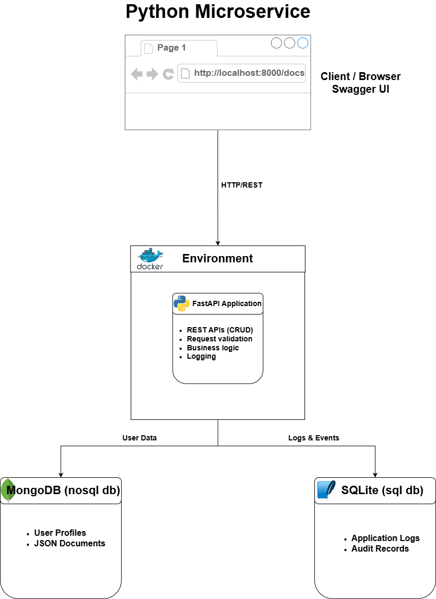

# Python Microservice with MongoDB & SQLite

A containerized Python microservice built with FastAPI that demonstrates the use of both SQL and NoSQL databases in a single application.

## Features
- Create and fetch user profiles via REST APIs
- Store user data in MongoDB
- Store application logs in SQLite
- Swagger UI for API testing

## Usage
`docker compose up`

